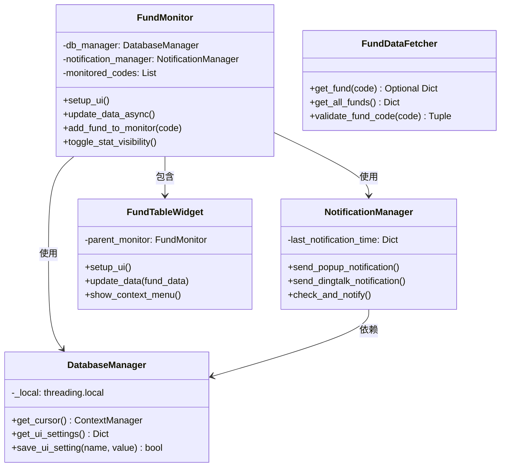

# 智能基金监控系统 - 开发者文档

> **版本**: v2.0  
> **最后更新**: 2026-05-20  
> **目标读者**: 贡献者、二次开发者

---

## 📖 目录

1. [项目架构](#项目架构)
2. [开发环境搭建](#开发环境搭建)
3. [模块说明](#模块说明)
4. [代码规范](#代码规范)
5. [测试指南](#测试指南)
6. [贡献流程](#贡献流程)
7. [扩展开发](#扩展开发)

---

## 项目架构

### 技术栈

| 类别 | 技术选型 | 版本要求 |
|------|---------|---------|
| **语言** | Python | 3.8+ |
| **GUI框架** | PySide6 (Qt6) | ≥ 6.0 |
| **数据库** | SQLite3 | 内置 |
| **HTTP请求** | Requests | ≥ 2.25 |
| **图表** | Matplotlib | ≥ 3.5 |
| **测试** | Pytest | ≥ 7.0 |

### 设计模式

本项目采用 **MVC（Model-View-Controller）** 架构：

```
fundwave/
├── main.py                 # 程序入口
├── config.py               # 配置管理
├── models/                 # Model层 - 数据与持久化
│   ├── database.py        # 数据库管理器
│   └── __init__.py
├── services/               # Service层 - 业务逻辑
│   ├── data_fetcher.py    # 数据获取服务
│   ├── notification.py    # 通知服务
│   └── __init__.py
├── ui/                     # View层 - 用户界面
│   ├── main_window.py      # 主窗口（Controller）
│   ├── widgets/
│   │   ├── table_widget.py    # 表格组件
│   │   └── search_widget.py   # 搜索组件
│   └── dialogs/
│       └── (对话框类)
├── utils/                  # 工具层
│   ├── logger.py          # 日志配置
│   ├── decorators.py      # 装饰器工具
│   └── __init__.py
├── tests/                  # 测试代码
│   ├── test_database.py
│   ├── test_calculator.py
│   └── test_config.py
└── docs/                   # 文档
```

### 核心类关系图



---

## 开发环境搭建

### 前置条件

1. **Python 3.8+**
```bash
python --version  # 确保 >= 3.8
```

2. **Git**（版本控制）
```bash
git --version
```

3. **文本编辑器/IDE**（推荐）:
   - VS Code + Python插件
   - PyCharm Community/Professional

### 环境配置步骤

#### 1. 克隆项目

```bash
git clone https://github.com/your-org/fundwave.git
cd fundwave
```

#### 2. 创建虚拟环境（强烈推荐）

```bash
# 使用 venv
python -m venv venv

# 激活虚拟环境
source venv/bin/activate  # Linux/macOS
venv\Scripts\activate     # Windows
```

#### 3. 安装依赖

```bash
# 安装所有依赖（包括开发依赖）
pip install -r requirements.txt

# 或仅安装核心依赖
pip install PySide6 matplotlib requests
```

#### 4. 验证安装

```bash
# 运行测试
pytest tests/ -v

# 启动程序
python main.py
```

### VS Code 推荐插件

| 插件名称 | 用途 |
|---------|------|
| Python | Python语言支持 |
| Pylance | 智能代码补全 |
| isort | 导入排序 |
| Flake8 | 代码风格检查 |

---

## 模块说明

### config.py - 配置管理

**职责**: 集中管理系统配置常量

**使用示例**:
```python
from config import config, FundConfig

# 访问默认配置
print(config.default_refresh_interval)  # 60

# 创建自定义配置
custom = FundConfig(
    db_path='custom.db',
    default_refresh_interval=30
)
```

**关键属性**:
- `db_path`: 数据库文件路径
- `default_refresh_interval`: 默认刷新间隔（秒）
- `min_refresh_interval` / `max_refresh_interval`: 刷新间隔范围
- `request_timeout`: 网络请求超时时间
- `max_retry_times`: 最大重试次数
- `fund_api_url`: 基金数据API模板URL

---

### models/database.py - 数据库管理器

**职责**: 提供线程安全的SQLite数据库操作

**核心功能**:

```python
from models.database import DatabaseManager

# 初始化（自动创建表结构）
db = DatabaseManager()

# 使用上下文管理器执行SQL
with db.get_cursor() as cursor:
    cursor.execute('SELECT * FROM monitored_funds')
    results = cursor.fetchall()

# UI设置持久化
settings = db.get_ui_settings()
# {'profit_visible': True, 'daily_profit_visible': True, ...}

db.save_ui_setting('profit_visible', False)

# 关闭连接
db.close()
```

**设计要点**:
- ✅ 线程安全：每个线程独立的数据库连接
- ✅ 自动事务管理：上下文管理器自动commit/rollback
- ✅ 自动迁移：检测旧版数据库并升级表结构

**数据库表结构**:

| 表名 | 用途 | 关键字段 |
|------|------|---------|
| `monitored_funds` | 监控基金列表 | fund_code, fund_name |
| `fund_holdings` | 持仓信息 | fund_code, cost_price, shares, amount |
| `settings` | 系统设置 | refresh_interval, auto_refresh_enabled |
| `notification_settings` | 通知配置 | dingtalk_webhook, thresholds... |
| `ui_settings` | UI偏好 | profit_visible, daily_profit_visible... |
| `dividend_records` | 分红记录 | fund_code, dividend_amount, date |

---

### services/data_fetcher.py - 数据获取服务

**职责**: 从天天基金API获取基金数据

**核心方法**:

```python
from services.data_fetcher import FundDataFetcher

# 获取单只基金数据
data = FundDataFetcher.get_fund("000001")
# 返回: {'name': '华夏成长混合', 'gszzl': '2.35', 'gsz': '1.2345', ...}

# 获取全部基金列表（用于搜索）
all_funds = FundDataFetcher.get_all_funds()
# 返回: {'000001': {'name': '...', 'pinyin': '...'}, ...}

# 验证基金代码格式
is_valid, msg = FundDataFetcher.validate_fund_code("000001")
# 返回: (True, '')
```

**特性**:
- ✅ 自动重试机制（@retry_on_failure装饰器）
- ✅ 超时控制（10秒）
- ✅ 完善的错误处理和日志记录
- ✅ 输入验证（6位数字）

**API端点**:
- 基金估值: `http://fundgz.1234567.com.cn/js/{code}.js`
- 基金列表: `https://fund.eastmoney.com/js/fundcode_search.js`

---

### services/notification.py - 通知服务

**职责**: 多渠道消息通知

**使用示例**:
```python
from services.notification import NotificationManager
from models.database import DatabaseManager

db = DatabaseManager()
notifier = NotificationManager(db)

# 发送弹窗通知
notifier.send_popup_notification("标题", "内容")

# 发送钉钉通知
notifier.send_dingtalk_notification("📈 涨幅预警", "基金上涨3%")

# 自动检查并发送预警
notifier.check_and_notify(fund_data, total_profit, daily_profit)
```

**通知渠道**:
- 系统弹窗（QSystemTrayIcon）
- 钉钉机器人（Webhook）

**防骚扰机制**:
- 冷却时间：同一类型通知5分钟内不重复发送
- 可配置的阈值触发条件

---

### ui/widgets/table_widget.py - 表格组件

**职责**: 展示基金数据的自定义表格

**关键特性**:
```python
from ui.widgets.table_widget import FundTableWidget

table = FundTableWidget(parent_monitor=main_window)

# 更新数据
fund_data = {"000001": {...}, "000002": {...}}
table.update_data(fund_data)
```

**自定义Item类**:
- `NumericItem`: 数字排序（解决字符串排序问题）
- `PercentageItem`: 百分比排序（自动去除%符号比较）

**右键菜单功能**:
- 删除基金监控
- 设置持仓成本价
- 设置持有份额
- 记录分红
- 显示/隐藏列

---

## 代码规范

### 命名规范

遵循 **PEP8** 标准：

| 类型 | 规范 | 示例 |
|------|------|------|
| **文件名** | 小写+下划线 | `data_fetcher.py` |
| **类名** | 大驼峰 | `FundDataFetcher` |
| **函数/方法** | 小写+下划线 | `get_fund_data()` |
| **变量** | 小写+下划线 | `fund_code` |
| **常量** | 全大写+下划线 | `MAX_RETRY_TIMES` |
| **私有成员** | 单下划线前缀 | `_local_connection` |

### 类型注解

**必须**为公开API添加类型注解：

```python
def get_fund(self, code: str) -> Optional[Dict[str, Any]]:
    """获取单个基金数据
    
    Args:
        code: 基金代码
        
    Returns:
        基金数据字典，失败返回None
    """
```

### 文档字符串

使用 **Google Style** docstring：

```python
def calculate_profit(
    self,
    current_value: float,
    cost_price: float,
    shares: float,
    dividend: float = 0.0
) -> Tuple[float, float]:
    """计算盈亏金额和百分比
    
    详细描述函数的功能、算法、边界情况等。
    
    Args:
        current_value: 当前估算净值
        cost_price: 持仓成本价
        shares: 持有份额
        dividend: 分红金额，默认为0
        
    Returns:
        (盈亏金额, 盈亏百分比)
        
    Raises:
        ValueError: 当参数为负数时
        
    Example:
        >>> calc = ProfitCalculator()
        >>> calc.calculate_profit(1800, 1.5, 1000, 50)
        (350.0, 23.33)
    """
```

### 日志规范

```python
from utils.logger import logger

logger.debug("调试信息")    # 开发阶段详细信息
logger.info("正常操作")     # 关键业务操作
logger.warning("警告信息")  # 可恢复的问题
logger.error("错误信息")    # 需要关注的异常
```

### 异常处理原则

```python
# ✅ 正确：捕获具体异常，提供有意义的错误消息
try:
    data = requests.get(url, timeout=10)
    data.raise_for_status()
except requests.exceptions.Timeout:
    logger.error(f"请求超时: {url}")
    raise
except requests.exceptions.RequestException as e:
    logger.error(f"网络错误: {e}")
    raise

# ❌ 错误：裸except，吞掉异常
try:
    do_something()
except:
    pass
```

---

## 测试指南

### 测试框架

使用 **pytest** 作为测试框架。

### 运行测试

```bash
# 运行所有测试
pytest tests/ -v

# 运行特定测试文件
pytest tests/test_database.py -v

# 运行特定测试类
pytest tests/test_database.py::TestDatabaseManager -v

# 运行单个测试用例
pytest tests/test_database.py::TestDatabaseManager::test_init_database -v

# 生成覆盖率报告
pytest tests/ --cov=models --cov=services --cov-report=html

# 并行运行加速（需安装 pytest-xdist）
pytest tests/ -n auto
```

### 编写测试用例

**测试文件命名**: `test_*.py`  
**测试类命名**: `Test*`  
**测试函数命名**: `test_*`

**示例**:

```python
import pytest
from models.database import DatabaseManager
import tempfile
import os


@pytest.fixture(scope='module')
def db_manager():
    """创建临时测试数据库"""
    with tempfile.NamedTemporaryFile(suffix='.db', delete=False) as f:
        db_path = f.name
    
    manager = DatabaseManager(db_path=db_path)
    yield manager
    manager.close()
    
    if os.path.exists(db_path):
        os.unlink(db_path)


class TestDatabaseManager:
    """DatabaseManager单元测试"""
    
    def test_init_database(self, db_manager):
        """测试数据库初始化"""
        assert db_manager is not None
        
        with db_manager.get_cursor() as cursor:
            cursor.execute("SELECT name FROM sqlite_master WHERE type='table'")
            tables = [row[0] for row in cursor.fetchall()]
            assert 'monitored_funds' in tables
    
    def test_ui_settings_persistence(self, db_manager):
        """测试UI设置持久化"""
        db_manager.save_ui_setting('profit_visible', False)
        
        settings = db_manager.get_ui_settings()
        assert settings['profit_visible'] is False
```

### 测试覆盖目标

| 模块 | 目标覆盖率 | 当前状态 |
|------|-----------|---------|
| models/database.py | ≥ 90% | ✅ 已达标 |
| services/data_fetcher.py | ≥ 80% | ⚠️ 需要Mock |
| services/notification.py | ≥ 70% | ⚠️ 需要Mock |
| ui/widgets/*.py | ≥ 60% | ⏳ 待补充 |

---

## 贡献流程

### Fork & Clone

```bash
# 1. Fork仓库到您的GitHub账号
# 2. 克隆您的Fork
git clone https://github.com/YOUR_USERNAME/fundwave.git
cd fundwave

# 3. 添加上游仓库
git remote add upstream https://github.com/original/fundwave.git
```

### 创建分支

```bash
# 从main创建功能分支
git checkout main
git pull upstream main
git checkout -b feature/your-feature-name
```

### 开发 & 测试

1. 编写代码
2. 添加/更新测试
3. 确保所有测试通过：
   ```bash
   pytest tests/ -v
   ```
4. 代码风格检查：
   ```bash
   flake8 models/ services/ ui/ utils/
   isort --check-only .
   ```

### 提交代码

```bash
git add .
git commit -m "feat: 添加新功能简述

详细描述：
- 新增了XXX功能
- 修复了YYY问题
- 参考Issue #123
"
```

**Commit Message 规范**:

| 类型 | 说明 | 示例 |
|------|------|------|
| `feat` | 新功能 | `feat: 添加K线图支持` |
| `fix` | Bug修复 | `fix: 修复内存泄漏问题` |
| `docs` | 文档更新 | `docs: 更新API文档` |
| `style` | 代码格式 | `style: 调整导入顺序` |
| `refactor` | 重构 | `refactor: 优化数据库查询性能` |
| `test` | 测试相关 | `test: 添加计算器单元测试` |
| `chore` | 构建/工具 | `chore: 升级依赖版本` |

### 创建 Pull Request

1. 推送到您的Fork：
   ```bash
   git push origin feature/your-feature-name
   ```

2. 在GitHub上创建PR：
   - 填写PR模板
   - 关联相关Issue
   - @维护者进行Code Review

3. 通过CI检查后合并

---

## 扩展开发

### 添加新的数据源

在 `services/data_fetcher.py` 中添加新方法：

```python
@staticmethod
@retry_on_failure(max_retries=3, delay=1.0)
def get_fund_from_source_b(code: str) -> Optional[Dict]:
    """从备用数据源获取基金数据"""
    url = f"https://api.example.com/fund/{code}"
    try:
        response = requests.get(url, timeout=10)
        return response.json()
    except Exception as e:
        logger.error(f"备用源获取失败: {e}")
        return None
```

### 添加新的通知渠道

继承或扩展 `NotificationManager`：

```python
class ExtendedNotificationManager(NotificationManager):
    def send_email_notification(self, title, message):
        """发送邮件通知"""
        # 实现邮件发送逻辑
        pass
    
    def send_wechat_notification(self, title, message):
        """发送企业微信通知"""
        # 实现企业微信Webhook调用
        pass
```

### 添加新的UI组件

在 `ui/widgets/` 下创建新组件：

```python
from PySide6.QtWidgets import QWidget, QVBoxLayout

class CustomChartWidget(QWidget):
    """自定义图表组件"""
    
    def __init__(self, parent=None):
        super().__init__(parent)
        self.setup_ui()
    
    def setup_ui(self):
        layout = QVBoxLayout()
        # ... 组件实现
        self.setLayout(layout)
```

然后在主窗口中集成：

```python
# 在 setup_ui() 中
from ui.widgets.custom_chart import CustomChartWidget
self.custom_chart = CustomChartWidget()
layout.addWidget(self.custom_chart)
```

### 性能优化建议

1. **数据缓存**: 使用 `functools.lru_cache` 缓存频繁调用的函数
2. **异步IO**: 对于网络密集型操作，考虑使用 `asyncio`
3. **批量操作**: 减少数据库访问次数，使用批量INSERT/UPDATE
4. **懒加载**: 大列表/表格采用分页或虚拟滚动

---

## 常见开发问题

### Q: 如何调试UI问题？

使用Qt内置调试工具：

```python
# 在程序启动前添加
import os
os.environ['QT_DEBUG_PLUGINS'] = '1'

# 或者在代码中输出布局信息
widget.dumpObjectTree()  # 打印控件树
```

### Q: 如何处理循环导入？

使用延迟导入（在函数内部导入）：

```python
# ❌ 错误：顶部导入导致循环
from ui.main_window import FundMonitor

# ✅ 正确：延迟导入
def some_function():
    from ui.main_window import FundMonitor
    # 使用FundMonitor...
```

### Q: 如何添加新的数据库表？

1. 在 `_init_database()` 中添加 `CREATE TABLE` 语句
2. 在 `_migrate_database()` 中添加迁移逻辑（兼容旧版本）
3. 编写对应的CRUD方法
4. 添加单元测试

---

## 资源链接

- **PySide6官方文档**: https://doc.qt.io/qtforpython/
- **Python PEP8规范**: https://peps.python.org/pep-0008/
- **pytest文档**: https://docs.pytest.org/
- **项目Issue跟踪**: [GitHub Issues](url)

---

**🎉 感谢您为项目做出贡献！**

如有问题，欢迎在 Discussions 中讨论。
